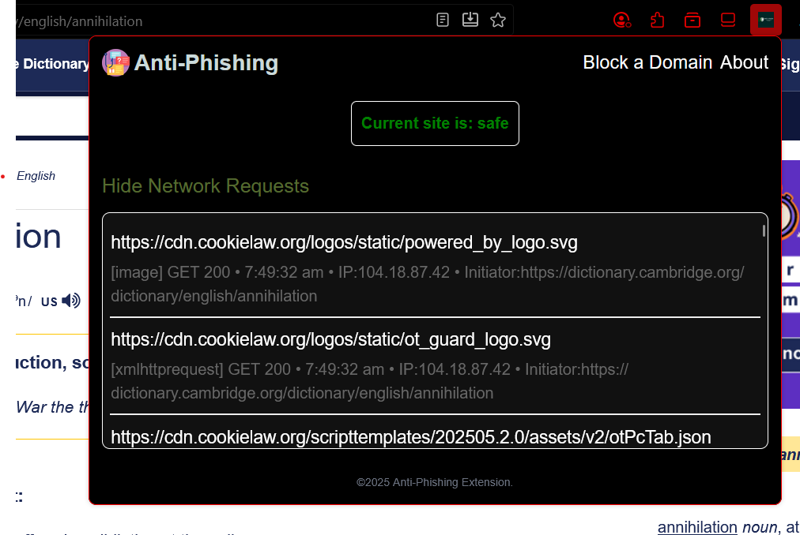
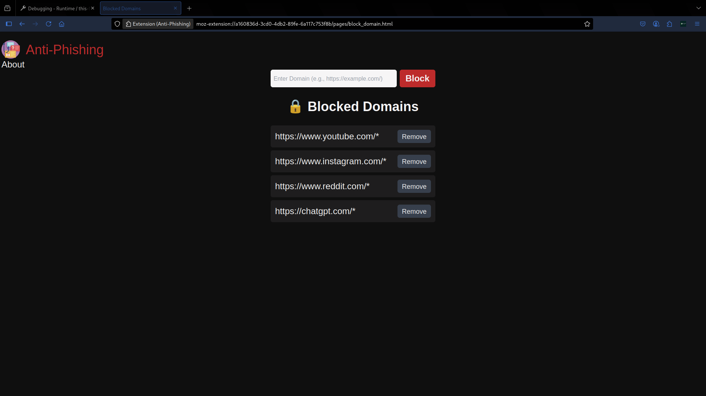
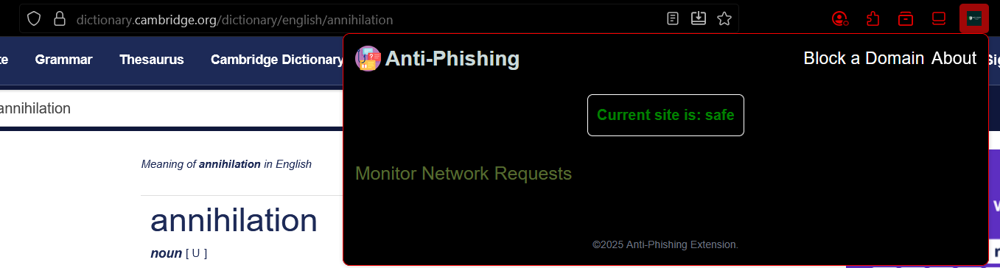
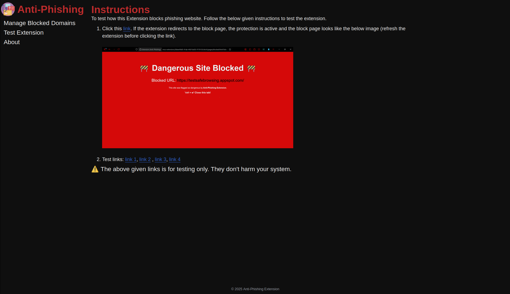

<h2 align="center">
Phishing Detection Extension
</h2>

<h2>About</h2>

    This is a browser extension-based project that detects phishing websites in real-time and alerts the user. Uses rule-based approach to identify phishing.This work presents a **real-time phishing detection system** that uses rule-based approach to effectively identify and prevent phishing attacks, spam, and defaced websites.

<h3 align="center">Updating the readme</h3>

<!-- ## Extension ScreenShots

 

 

 

 

### Demo Video

https://github.com/user-attachments/assets/c8396764-5757-4e8f-bbe3-2df44fbd0adf

 

### 💫 Features of the system

- ⚙️ Custom Domain Blocking

- 🌐 Network Request Logger

- 🔒 Google Safe Browsing (GSB) Integration

- 🧠 Smarter Background Logic

### ⚙️ Tech Stack

#### UI

- HTML
- CSS
- JavaScript
- TailwindCSS

#### Back-end

- Backend (API Layer): Node.js + Express (acts as a secure proxy to Google Safe Browsing API)

#### Storage

- Browser’s Local Storage (for user preferences, logs, and blocked domains) -->

## 📊 Repository activity

