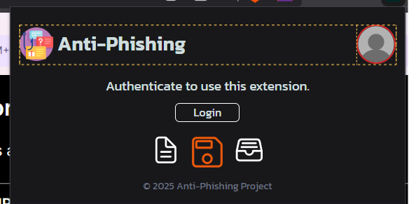
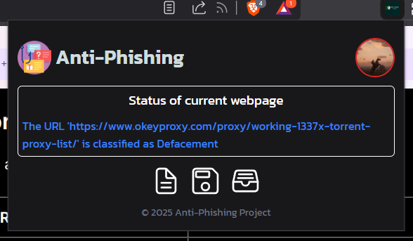
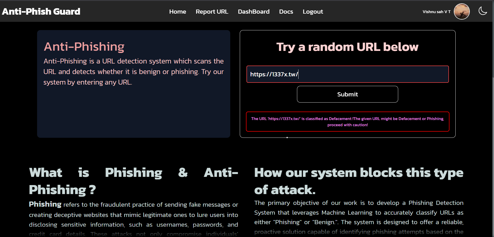

# Phishing Detection with Machine Learning integration

### This is a browser extension based project which detects phishing websites in real-time and alerts the user.

### Table of Contents:

1. [Introduction](#introduction)

2. [📼 Project Screenshots](#project-screenshots)

3. [💫 Features of the system](#features-of-the-system)

4. [⚙️ Tools and Frameworks](#tools-and-frameworks)

5. [🧑🏻‍💻 Installation on local machine](#installation-on-local-machine)

6. [Conclusion](#conclusion)

# Introduction

---

<div >

This work presents a **real-time phishing detection system** that integrates machine learning models to effectively identify and prevent phishing attacks, spam, and defaced websites. The system is **designed to analyze various key URL features such as length, domain, subdomain, numeric characters, special characters, and the presence of HTTPS, providing a comprehensive approach to phishing detection.**

Also the system will be used as browser extension with some features like: **total no.of scan, no.of phishing websites detected and authenticated users are allowed to report spam websites manually.**

</div>

# Project Screenshots



<br/>



<br/>



<br/>

# 💫 Features of the system

- All Phishing Detection is done via API (FastAPI).

- Authenticated Users can report Malicious website URL in the extension.

- Reported URLs are then used in model to train and enhance prediction.

- Authenticated Users can track their activity in dashboard.

# ⚙️ Tools and Frameworks

<h3  style="margin-top: 0;margin-bottom: 1rem;">Front-end languages & frameworks used</h3>

- HTML
- CSS
- JavaScript
- TailwindCSS

<h3  style="margin-top: 0;margin-bottom: 1rem;">Back-end languages & libraries used</h3>

- Python
- Pandas
- NumPy
- FastAPI

<h3 style="margin-top: 0;margin-bottom: 1rem;">DataBase used</h3>

- SQLite3 (local)
- PostgreSQL(production)
</div>

## 🧑🏻‍💻 Installation on local machine

### Initializing Backend Server

Backend server runs on Python so we need to install the libraries to run.

- Before installing libraries create venv

```bash
python -m venv venv-name
```

- After executing the above line.

- Activate the venv and install requirements.

- To **install python dependencies**, find the **requirements.txt** file, then go to directory where the file is located run the below line in the terminal.

```bash
pip install -r requirements.txt
```

- Navigate to **/Main/scripts/** then execute the below line to run the server.

```bash
uvicorn main:app --port 8000
```

**Remember the server only runs on localhostport:8000**

> If DataBase issues arise at initial stage, create dir name **'Database'**. Then try again running the server.

> If Google authentication issue arises. Add the Oauth credentials (Client ID & Secret) **which is created by you from Google Cloud Account**🙂. To those who don't know how to setup Oauth Credentials [watch here](https://youtu.be/TjMhPr59qn4?si=fF22b_77npApIcur). Then store the creadentials in '.env' file.
> <br/>

# Conclusion

This system offers a sophisticated approach to mitigating the risks associated with phishing attacks. That's all

<h1 style="text-align:center;">Thank you</h1>
